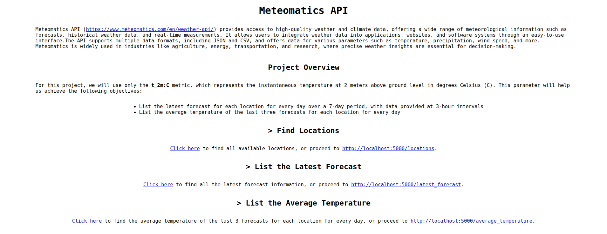

# Meteomatics API
[Meteomatics API](https://www.meteomatics.com/en/weather-api/) provides access to high-quality weather and climate data, 
offering a wide range of meteorological information such as forecasts, historical weather data, and real-time measurements. 
It allows users to integrate weather data into applications, websites, and software systems through an easy-to-use interface. 
The API supports multiple data formats, including JSON and CSV, and offers data for various parameters such as temperature, 
precipitation, wind speed, and more. Meteomatics is widely used in industries like agriculture, energy, transportation, 
and research, where precise weather insights are essential for decision-making.

## Project Overview 
For this project, we will use only the **t_2m:C** metric, which represents the instantaneous temperature at 2 meters 
above ground level in degrees Celsius (°C). This parameter will help us achieve the following objectives:
- List the latest forecast for each location for every day over a 7-day period, with data provided at 3-hour intervals
- List the average temperature of the last three forecasts for each location for every day 

Note: In a future release, additional metrics will be used, including a method to retrieve top-n locations for each available metric

## System Architecture
This project fetches weather forecast data for multiple locations via the Meteomatics API, using Flask for the API layer 
and PostgreSQL for data storage. The system is containerized and orchestrated using Docker Compose for ease of deployment.

### Environment
- Docker Desktop v4.36.0 and Docker Compose version v2.30.3-desktop.1
- Ubuntu 24.04

Note: If you are using Windows, consider using Git Bash or Windows Subsystem for Linux (WSL)

### Key Components:
1. Fetch Weather Data:
   - Location Search: Utilizes the endpoint https://api.meteomatics.com/find_station?source=mm-mos to find available weather 
   stations for specific locations
   - Forecast Retrieval: Using the URL: https://api.meteomatics.com/nowP7D/t_2m:C/{lat_lon}/json, 
   where {lat_lon} represents the latitude and longitude of the desired location (e.g. 47.3769,8.5417 for Zurich) 
   to fetch 7-day weather forecast data at 3-hour interval
2. Data Ingestion:
   - Fetched data is parsed and stored into a PostgreSQL database 
   - Additionally, data is stored in the database_data folder, which includes the following CSV files:
      - forecasts.csv
      - locations.csv
3. API Layer:
   - A Flask-based API is exposed, allowing users to query the stored weather data via a RESTful interface

## Technologies Used
  - Python: Main programming language for ETL implementation
  - Flask: Web framework to create the RESTful API 
  - PostgreSQL: SQL database for persisting weather records
  - pgAdmin4: PostgreSQL Web UI
  - Docker & Docker Compose: Containerized services for Flask, PostgreSQL, and pgAdmin4
  
## Hands-on
### Clone the repository
```
git clone https://github.com/dimitriszrv/meteomatics_api-flask-postgresql-docker.git
```

### Go to project
```
cd meteomatics_api-flask-postgresql-docker/
```

### Build project using Dockerfile and docker-compose.yml file
All containers are build up and running with:
```
make build
```


### Flask API
- Accessible using: http://localhost:5000/


### Locations 
- Accessible using the Locations Endpoint: http://localhost:5000/locations


### Latest Forecasts
- Accessible using the Latest Forecasts Endpoint: http://localhost:5000/latest_forecast


### Average Temperature
- Accessible using the Average Temperature Endpoint: http://localhost:5000/average_temperature


## PostgreSQL
Accessible using pgAdmin4: http://localhost:5433/, with username: user@api.com,  password: user@api.com 


### Connecting to PostgreSQL Server
1. Click at Add New Server


2. Set Name as postgresql at General Tab


3. At Connection Tab, set the following:
   - Host name/address: postgresql
   - Port: 5432
   - Maintenance database: postgres
   - Username: admin
   - Password: admin


4. Right click on Servers > postgresql > Databases > meteomatics_api > Schemas > public > Tables > Query Tool


5. Example for Latest Forecasts:


### How to use Makefile
- build and start containers: make build
- start containers: make up
- stop containers: make stop
- remove containers: make remove
- show logs: make logs

### Notes
**Before executing** make build create a user at https://www.meteomatics.com/en/sign-up-weather-api-test-account/,
and set the correct credentials of API_CONFIG in the app/configs/flask.env file<br>

Example credentials (are valid until: 2025-01-17) for API_CONFIG:<br>
{"user": "api_pass_user","password": "80rNUr2Xqs"}